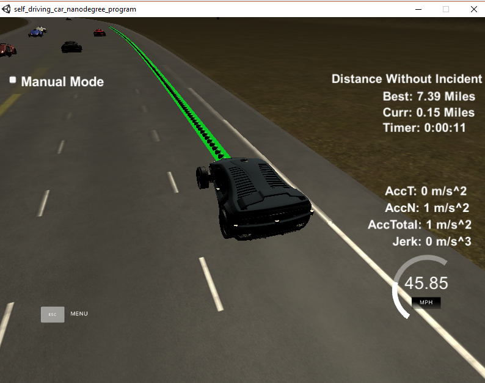

# Udacity Self-Driving Car Engineer Nanodegree
# Path Planning Project

## Introduction

The goal of this project is to navigate a car around track which simulates highway environment, based on track waypoints, car telemetry and sensor fusion data. Car behaviour should be safe and comfortable for passengers:
1. Car should stay in lane for most of the time (can leave lane no more then for 3 sec)
2. Speed should be close to 50 mph, or to traffic speed in lane
3. Car shouldn't exceed certain amount of acceleration and jerk
4. Should avoid any collisions

This implementation is summarized in the following steps:
1. Generate predictions from sensor fusion data
2. Generate trajectories for the car
3. Determine best trajectory
4. Produce new path

## Implementation
To work with Frenet coordinates was changed `getXY` implementation, which makes conversion more precise. From waypoint information 4 splines are generated
 and then used to get x and yneous telemetry data for the ego vehicle, but it also returns the list of points from previously generated path. This is used to project the car's state into the future and a "planning state" is determined based on the difference between points at some prescribed number of points along the previous path. In effect, this can help to generate smoother transitions, handle latency from transmission between the controller and the simulator, and alleviate the trajectory generator of some computation overhead. 

 
        double x = s_x(s) + d*s_dx(s);
        double y = s_y(s) + d*s_dy(s);

### 1. Generate Predictions from Sensor Fusion Data

From sensor fusion data received from the simulator we are getting current position and speed for nearby cars. To predict their future states I assume that they have constant speed and keep the same lane. For each car was generated trajectory for 10 sec with step 0.2 sec.

### 2. Generate Trajectories for The Car

As our car don't have any final goal on the road there are no need of many states for the car, or even any states at all. For implementation I've choosen approach described in   [Optimal Trajectory Generation For Dynamic Street Scenarious in A Frenet Frame](https://d17h27t6h515a5.cloudfront.net/topher/2017/July/595fd482_werling-optimal-trajectory-generation-for-dynamic-street-scenarios-in-a-frenet-frame/werling-optimal-trajectory-generation-for-dynamic-street-scenarios-in-a-frenet-frame.pdf). 
 A Path-Planner generates a set of trajectories with start state at the end of previous path and different target `s` and `d` states and different time reaching those states. Then for each trajectory we produce two quintic polynomial, jerk-minimizing (JMT) trajectories, one for `s` and another for `d` state. Combination of them gives us sequence of Frenet coordinates for path generation.

### 3. Determine Best Trajectory

With each trajectory we associate cost value, which calculates based on:
1. Collision cost: penalize collisions with other vehicles
2. Safety cost: penalize being too close to other vehicles
3. Jerk, Acceleration cost: penalize exceeding maximum allowed values
4. Velocity cost: penalize velocity exceeding 50 mph and velocity which are much lower then 50 mph
5. Lane cost: penalize trajectory leading to slow lanes

Trajectory with the lowest cost are used to generate new path.

### 4. Produce New Path

New path is union of old path points and some points along selected trajectory starting where previous path have ended. No smoothing is performed.

## Conclusion

The resulting path planner works good, by changing cost coefficients and car behaviour could be changed by changing cost function. Currently car could drive 7 miles without accident, sometimes when car in outside lane there message that "Car outside the lane" when visually car in the middle of the lane.


I still need to improve cost function, should penalize car staying outside the lane and penalize when car comes closely to the leading car.

*the description below is Udacity's original README for the project repo*

# CarND-Path-Planning-Project
Self-Driving Car Engineer Nanodegree Program
   
### Simulator.
You can download the Term3 Simulator which contains the Path Planning Project from the [releases tab (https://github.com/udacity/self-driving-car-sim/releases).

### Goals
In this project your goal is to safely navigate around a virtual highway with other traffic that is driving +-10 MPH of the 50 MPH speed limit. You will be provided the car's localization and sensor fusion data, there is also a sparse map list of waypoints around the highway. The car should try to go as close as possible to the 50 MPH speed limit, which means passing slower traffic when possible, note that other cars will try to change lanes too. The car should avoid hitting other cars at all cost as well as driving inside of the marked road lanes at all times, unless going from one lane to another. The car should be able to make one complete loop around the 6946m highway. Since the car is trying to go 50 MPH, it should take a little over 5 minutes to complete 1 loop. Also the car should not experience total acceleration over 10 m/s^2 and jerk that is greater than 50 m/s^3.

#### The map of the highway is in data/highway_map.txt
Each waypoint in the list contains  [x,y,s,dx,dy] values. x and y are the waypoint's map coordinate position, the s value is the distance along the road to get to that waypoint in meters, the dx and dy values define the unit normal vector pointing outward of the highway loop.

The highway's waypoints loop around so the frenet s value, distance along the road, goes from 0 to 6945.554.

## Basic Build Instructions

1. Clone this repo.
2. Make a build directory: `mkdir build && cd build`
3. Compile: `cmake .. && make`
4. Run it: `./path_planning`.

Here is the data provided from the Simulator to the C++ Program

#### Main car's localization Data (No Noise)

["x"] The car's x position in map coordinates

["y"] The car's y position in map coordinates

["s"] The car's s position in frenet coordinates

["d"] The car's d position in frenet coordinates

["yaw"] The car's yaw angle in the map

["speed"] The car's speed in MPH

#### Previous path data given to the Planner

//Note: Return the previous list but with processed points removed, can be a nice tool to show how far along
the path has processed since last time. 

["previous_path_x"] The previous list of x points previously given to the simulator

["previous_path_y"] The previous list of y points previously given to the simulator

#### Previous path's end s and d values 

["end_path_s"] The previous list's last point's frenet s value

["end_path_d"] The previous list's last point's frenet d value

#### Sensor Fusion Data, a list of all other car's attributes on the same side of the road. (No Noise)

["sensor_fusion"] A 2d vector of cars and then that car's [car's unique ID, car's x position in map coordinates, car's y position in map coordinates, car's x velocity in m/s, car's y velocity in m/s, car's s position in frenet coordinates, car's d position in frenet coordinates. 

## Details

1. The car uses a perfect controller and will visit every (x,y) point it recieves in the list every .02 seconds. The units for the (x,y) points are in meters and the spacing of the points determines the speed of the car. The vector going from a point to the next point in the list dictates the angle of the car. Acceleration both in the tangential and normal directions is measured along with the jerk, the rate of change of total Acceleration. The (x,y) point paths that the planner recieves should not have a total acceleration that goes over 10 m/s^2, also the jerk should not go over 50 m/s^3. (NOTE: As this is BETA, these requirements might change. Also currently jerk is over a .02 second interval, it would probably be better to average total acceleration over 1 second and measure jerk from that.

2. There will be some latency between the simulator running and the path planner returning a path, with optimized code usually its not very long maybe just 1-3 time steps. During this delay the simulator will continue using points that it was last given, because of this its a good idea to store the last points you have used so you can have a smooth transition. previous_path_x, and previous_path_y can be helpful for this transition since they show the last points given to the simulator controller with the processed points already removed. You would either return a path that extends this previous path or make sure to create a new path that has a smooth transition with this last path.

## Tips

A really helpful resource for doing this project and creating smooth trajectories was using http://kluge.in-chemnitz.de/opensource/spline/, the spline function is in a single hearder file is really easy to use.

---

## Dependencies

* cmake >= 3.5
 * All OSes: [click here for installation instructions](https://cmake.org/install/)
* make >= 4.1
  * Linux: make is installed by default on most Linux distros
  * Mac: [install Xcode command line tools to get make](https://developer.apple.com/xcode/features/)
  * Windows: [Click here for installation instructions](http://gnuwin32.sourceforge.net/packages/make.htm)
* gcc/g++ >= 5.4
  * Linux: gcc / g++ is installed by default on most Linux distros
  * Mac: same deal as make - [install Xcode command line tools]((https://developer.apple.com/xcode/features/)
  * Windows: recommend using [MinGW](http://www.mingw.org/)
* [uWebSockets](https://github.com/uWebSockets/uWebSockets)
  * Run either `install-mac.sh` or `install-ubuntu.sh`.
  * If you install from source, checkout to commit `e94b6e1`, i.e.
    ```
    git clone https://github.com/uWebSockets/uWebSockets 
    cd uWebSockets
    git checkout e94b6e1
    ```

## Editor Settings

We've purposefully kept editor configuration files out of this repo in order to
keep it as simple and environment agnostic as possible. However, we recommend
using the following settings:

* indent using spaces
* set tab width to 2 spaces (keeps the matrices in source code aligned)

## Code Style

Please (do your best to) stick to [Google's C++ style guide](https://google.github.io/styleguide/cppguide.html).

## Project Instructions and Rubric

Note: regardless of the changes you make, your project must be buildable using
cmake and make!


## Call for IDE Profiles Pull Requests

Help your fellow students!

We decided to create Makefiles with cmake to keep this project as platform
agnostic as possible. Similarly, we omitted IDE profiles in order to ensure
that students don't feel pressured to use one IDE or another.

However! I'd love to help people get up and running with their IDEs of choice.
If you've created a profile for an IDE that you think other students would
appreciate, we'd love to have you add the requisite profile files and
instructions to ide_profiles/. For example if you wanted to add a VS Code
profile, you'd add:

* /ide_profiles/vscode/.vscode
* /ide_profiles/vscode/README.md

The README should explain what the profile does, how to take advantage of it,
and how to install it.

Frankly, I've never been involved in a project with multiple IDE profiles
before. I believe the best way to handle this would be to keep them out of the
repo root to avoid clutter. My expectation is that most profiles will include
instructions to copy files to a new location to get picked up by the IDE, but
that's just a guess.

One last note here: regardless of the IDE used, every submitted project must
still be compilable with cmake and make./

## How to write a README
A well written README file can enhance your project and portfolio.  Develop your abilities to create professional README files by completing [this free course](https://www.udacity.com/course/writing-readmes--ud777).

